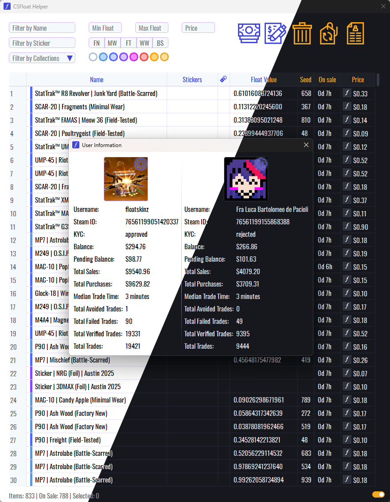

# CSFloat Helper



Desktop application for convenient inventory management on CSFloat marketplace (CS2).

## Features

### Listing Management
- **Bulk Listing** — list multiple items for sale at once
- **Delisting** — quickly remove items from sale
- **Relisting** — relist items back to marketplace
- **Price Changes** — three methods:
  - Set new price value
  - Change price by fixed amount (+/- fixed sum)
  - Change price by percentage (+/- %)

### Personalization
- **Custom Note per Account** — configure individual listing note for each API key
- **Multi-account Support** — work with multiple accounts simultaneously

### Filtering and Display
- Filters by item name, collection, rarity, wear condition
- Filters by stickers and float value
- Display days on sale for each item
- Information about price, stickers, keychains
- Status bar showing item count, listings on sale, and selected items

### Additional Features
- View user information (Steam ID, balance, sales statistics)
- Keep Online — automatically maintain online status
- Light/Dark theme switching
- Image caching for fast loading

## Installation and Setup

### Requirements
- Python 3.7 or higher
- Windows / Linux / macOS

### Quick Start

1. Clone the repository or download the archive

2. **Rename** `config.example.json` to `config.json`:
```bash
# Linux/macOS
mv config.example.json config.json

# Windows
ren config.example.json config.json
```

3. **Open** `config.json` and insert your CSFloat API key:
```json
{
    "api_keys": [
        "YOUR_CSFLOAT_API_KEY"
    ]
}
```

Replace `YOUR_CSFLOAT_API_KEY` with your actual API key.

> **How to get CSFloat API key:**
> 1. Go to [CSFloat](https://csfloat.com/)
> 2. Log in to your account
> 3. Open profile settings → API
> 4. Create a new API key

**Multiple accounts:** To add more accounts, simply add more keys to the array:
```json
{
    "api_keys": [
        "first_account_api_key",
        "second_account_api_key",
        "third_account_api_key"
    ]
}
```

### Running

#### Windows (Recommended):
Simply run the launcher - it will automatically install dependencies if needed:
```bash
run_csfloat_helper.bat
```

#### Linux/macOS or Manual Launch:
```bash
pip install -r requirements.txt
python csfloat_helper.py
```

## Usage

1. **Select account** from dropdown (if using multiple API keys)
2. **Load inventory** — click "Load Inventory" button
3. **Apply filters** — use search fields and filters to find needed items
4. **Select items** — check the items you need in the table
5. **Execute operation**:
   - Sell — list items for sale
   - Delist — remove items from sale
   - Change Price — modify price of listed items
   - Swap — swap prices between two items

## Security

- API keys are stored locally and **hashed** in Windows registry (SHA-256)
- **Never share your API key with third parties**

## Technologies

- **Python 3.7+**
- **PyQt6** — graphical interface
- **urllib** — HTTP requests to CSFloat API
- **orjson** — fast JSON parsing
- **Threading** — asynchronous operations

## Project Structure

```
CSFloat-Helper-main/
├── csfloat_helper.py           # Entry point
├── config.json                 # API keys (create from config.example.json)
├── requirements.txt            # Dependencies
├── run_csfloat_helper.bat     # Quick launch (Windows)
│
├── modules/                    # Core modules
│   ├── api.py                 # CSFloat API integration
│   ├── ui.py                  # Main application window
│   ├── workers.py             # Background threads
│   ├── theme.py               # Theme system
│   └── ...
│
├── utils/                      # Resources (icons, fonts)
└── cache/                      # Image cache
```

## Contributing

If you have suggestions for improvements or found a bug:
1. Create an Issue on GitHub
2. Submit a Pull Request with description of changes

## License

MIT License

---

**CSFloat Helper** — fast and convenient CS2 inventory management.
